1. Под Windows скачал установочник PostgreSQL с официального сайта и установил. Заодно поставил и pgsql
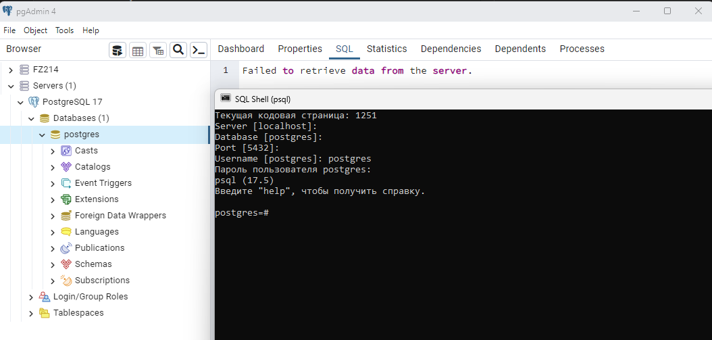
1. Указал папку bin в Path переменных окружения, чтобы было проще выполнять команды.
1. Скачал тестовую БД с сайта:
https://postgrespro.ru/docs/postgrespro/15/demodb-bookings-installation
Установил demo-medium
Установил через cmd:
psql -U postgres -f demo-medium-20170815.sql

1. Дальше нужно во первых провести инициализацию pgbench, т.е. создать служебные таблицы под него:
pgbench -i demo
А дальше запустить pgbench на тестовой БД:
pgbench -c8 -P 6 -T 60 -U postgres demo
команда имитирует нагрузку где ключи:
-с - количество коннектов к БД
-j - параллельно работающие джобы
-P - периодичность сообщений (каждое сообщение через такое то время)
-T - все время выполнения

Но тут у меня начались проблемы с bgbench. У меня не получалось изменить кодировку (через chcp). Выпадали непонятние символы вместо русского текста, а основной текст ошибки был:
pgbench: error: could not create connection for initialization

Из-за обрезанной Windows отключены некоторые службы, в частности WSL мне недоступен. И я решил начать сначала и перейти на виртуальную машину (Использую VMware Workstation Pro), где установлен Ubuntu.

1. Установил postgreSQL командой:
sudo apt install postgresql postgresql-contrib

1. По доке https://www.pgadmin.org/download/pgadmin-4-apt/
Устанавливаем public ключ для репозитория:
curl -fsS https://www.pgadmin.org/static/packages_pgadmin_org.pub | sudo gpg --dearmor -o /usr/share/keyrings/packages-pgadmin-org.gpg
И затем создать файл конфигурации репозитория:
sudo sh -c 'echo "deb [signed-by=/usr/share/keyrings/packages-pgadmin-org.gpg] https://ftp.postgresql.org/pub/pgadmin/pgadmin4/apt/$(lsb_release -cs) pgadmin4 main" > /etc/apt/sources.list.d/pgadmin4.list && apt update'
1. Устанавил pgAdmin:
sudo apt install pgadmin4
Вот что получилось:
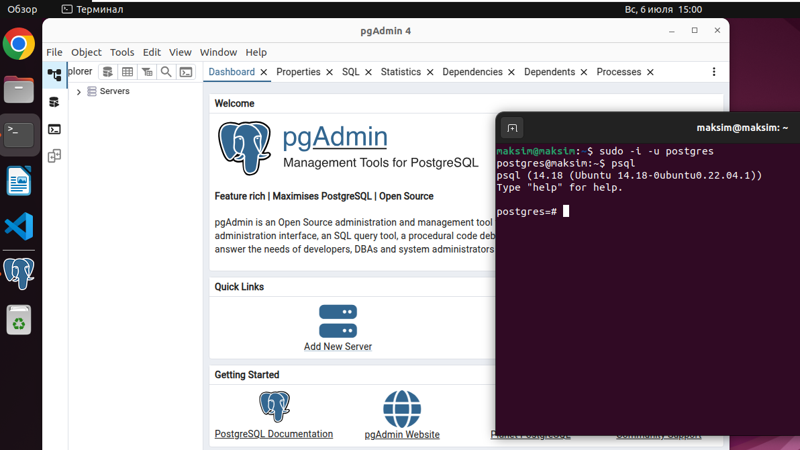
1. Зарегистрировал localhost в pgAdmin:
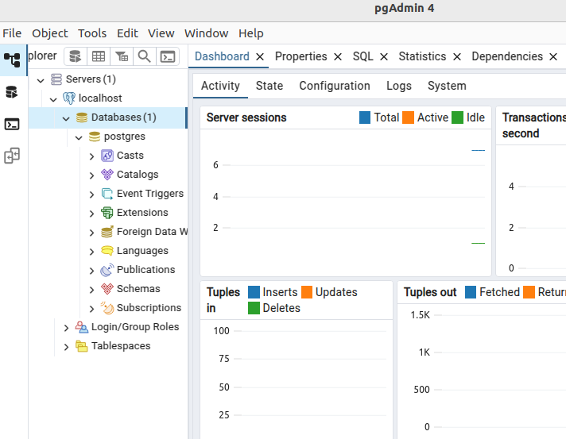
1. Сильно запарился с запуском скрипта для наполнения тестовой БД. Из-за проблем прав доступа. В итоге пришлось перемещать файл в папку tmp и создавать доступ пользователю postgres до этой папки:
cp /home/maksim/Загрузки/demo-medium/demo-medium-20170815.sql /tmp/
sudo chown postgres:postgres /tmp/demo-medium-20170815.sql
После этого удалось выполнить скрипт:
sudo -i -u postgres
psql -f /tmp/demo-medium-20170815.sql
1. В этот раз удалось проинициализировать pgbench:
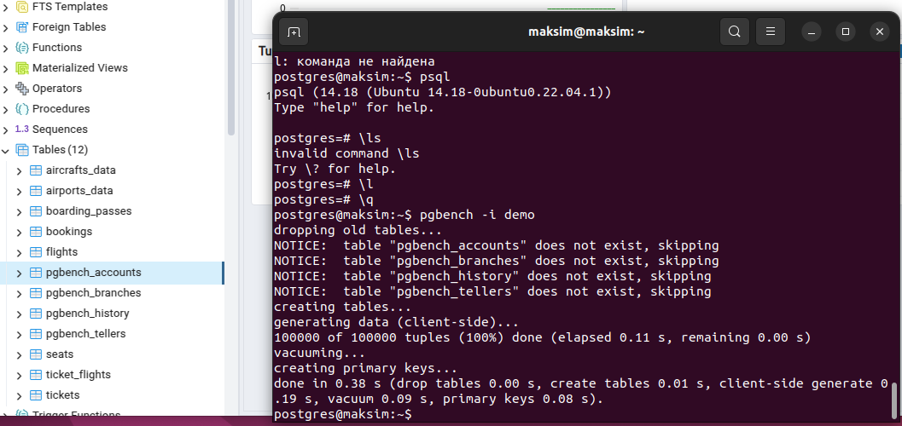
1. Запустил команду:
pgbench -c8 -P 6 -T 60 -U postgres postgres
Получил следующие результаты:
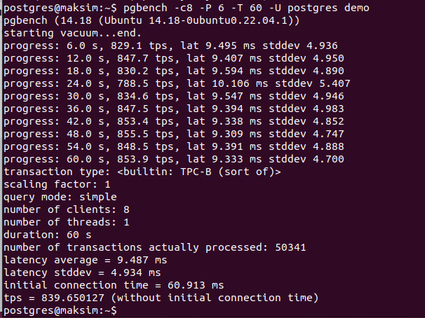
number of transactions actually processed: 50341 (Всего выполнено транзакций)
latency average = 9.487 ms (Средняя задержка. Время на одну транзакцию в среднем)
latency stddev = 4.934 ms (Насколько задержки отличаются от среднего значения)
tps = 839.650127 (Производительность базы данных в транзакциях в секунду)
1. Посмотрим параметры Vacuum. Сначала узнаем текущие значения с помощью команды:
select name, setting, context, short_desc
from pg_settings where name like 'vacuum%';
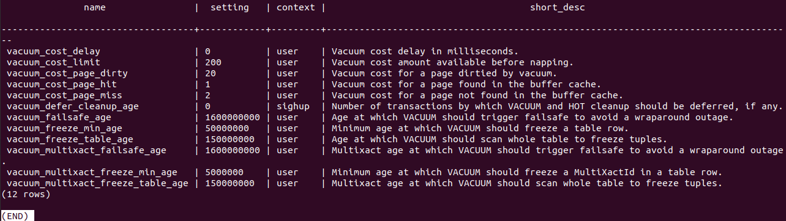
vacuum_cost_delay - время на которое процесс Vacuum может засыпать (стоит 0 - значит Vacuum засыпать не будет).
vacuum_cost_limit - ограничение стоимости
vacuum_cost_page_hit - стоимость чтения записи из кэша
vacuum_cost_page_miss - стоимость чтения записи из кэша ОС (не кэш и не диск)
vacuum_cost_page_dirty - стоимость чтения записи из диска
1. Попробую их изменить:
vacuum_cost_page_miss на 5
vacuum_cost_page_dirty на 10
В файле postgresql.conf
И перезагружаю postgres:
sudo systemctl reload postgresql
Результат следующий:
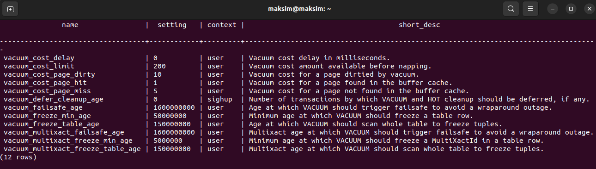
1. Смотрю параметры Autovacuum с помощью команды:
SELECT name, setting, context, short_desc
FROM pg_settings WHERE name like 'autovacuum%';
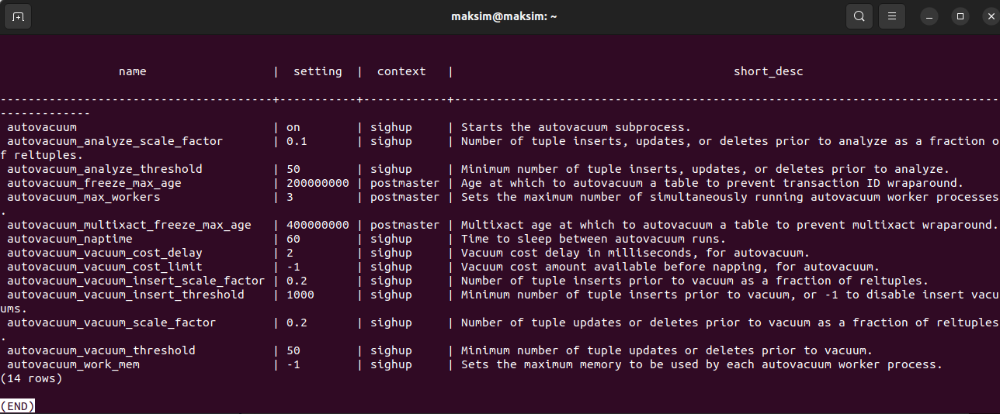
Выставил параметры:
ALTER SYSTEM SET autovacuum_max_workers to '4'; (у меня всего 4 ядра на ПК)
ALTER SYSTEM SET autovacuum_naptime to '15'; (время на которое засыпает автовакуум)
ALTER SYSTEM SET autovacuum_vacuum_threshold to '25';
ALTER SYSTEM SET autovacuum_vacuum_scale_factor to '0.05';
Формула для этих 2х параметров:
порог_запуска = autovacuum_vacuum_threshold + (autovacuum_vacuum_scale_factor × число_строк_в_таблице)
ALTER SYSTEM SET autovacuum_vacuum_cost_delay to '10';
ALTER SYSTEM SET autovacuum_vacuum_cost_limit to '1000';
1. Дальше сделал рестарт postgresql, чтобы параметры применились:
sudo systemctl restart postgresql
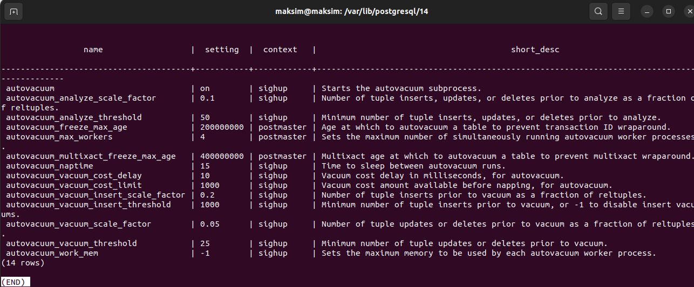
1. Вызываем новый проход pgbench:
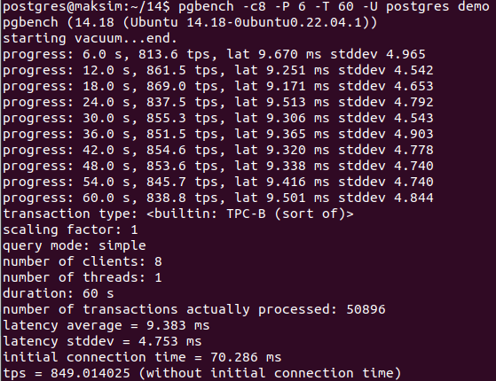
В целом большой разницы параметры не сыграли. Немного упал tps. Но что интересно выросло и количество транзакций. Пробовал ещё экспериментировать с параметрами autovacuum_vacuum_threshold и autovacuum_vacuum_scale_factor, но улучшения показателей добиться не удалось. Возможно дело в размере БД.
1. Пробую создать таблицу с текстовым полем text и 1 млн рандомных записей:
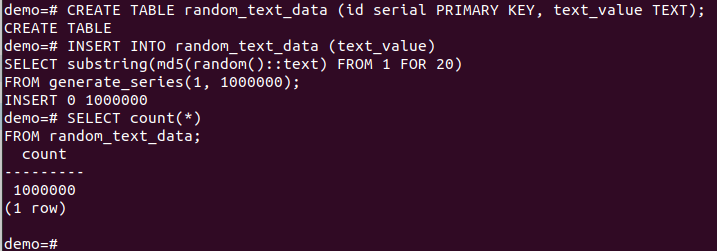
Получившийся размер таблицы можно посмотреть в pgAdmin:
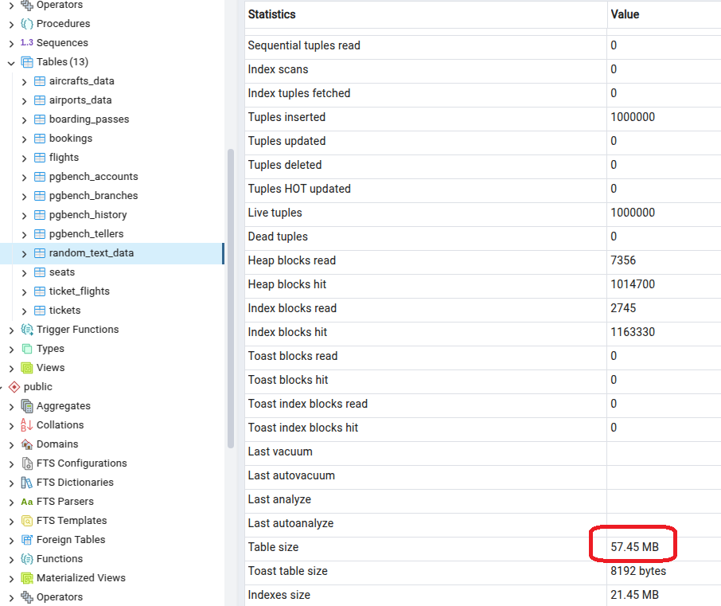
1. Дальше 5 раз обновляю поле random_text_data для всех записей в таблице random_text_data с помощью запроса:
UPDATE random_text_data
SET text_value = substring(md5(random()::text) FROM 1 FOR 20);
Получился следующий размер таблицы при условии что как раз при выполнении нескольких операций у меня сработал автовакуум:
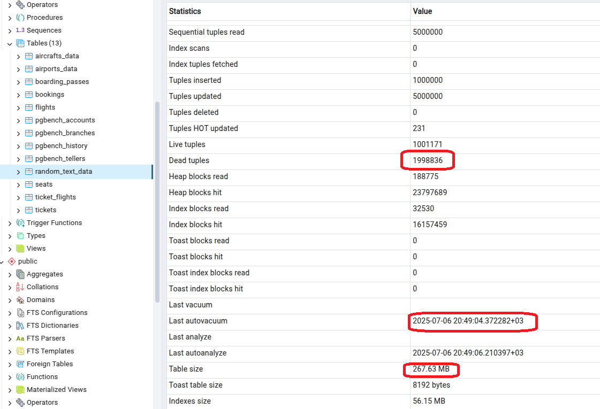
Также в параметре Dead tuples вижу кол-во мертвых записей.
1. Спустя 14 секунд автовакуум прошелся снова и удалил все мертвые записи:
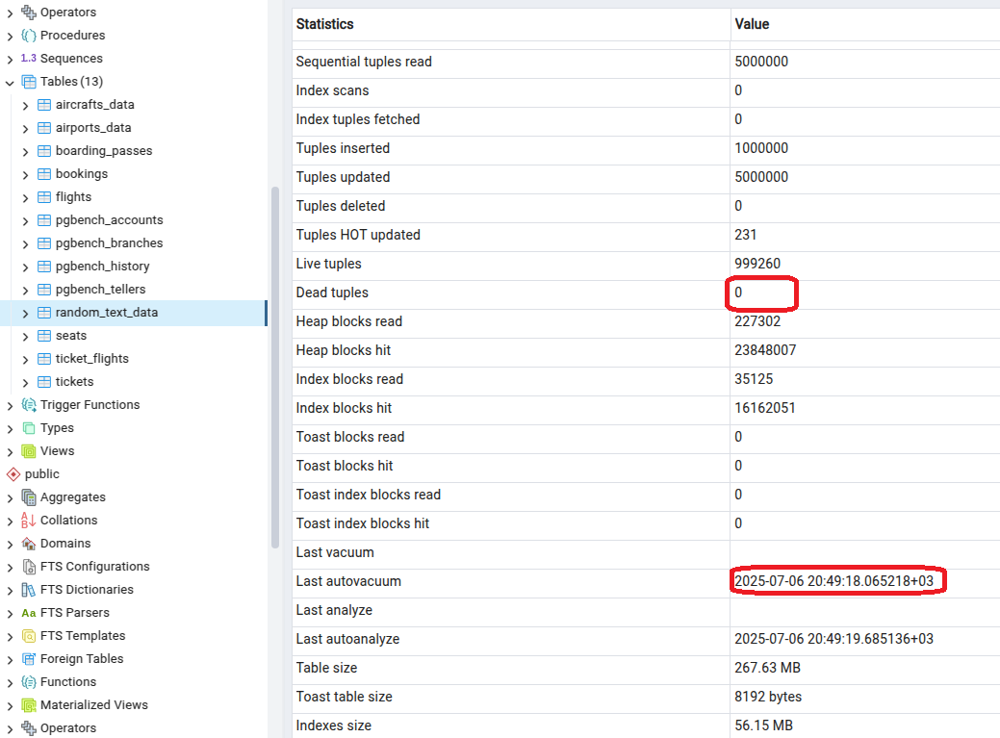
1. Далее отключу автовакуум на таблице операцией:
ALTER TABLE random_text_data SET (autovacuum_enabled = false);
И попробую выполнить 5 полных обновлений таблицы random_text_data снова.
Результаты следующие:
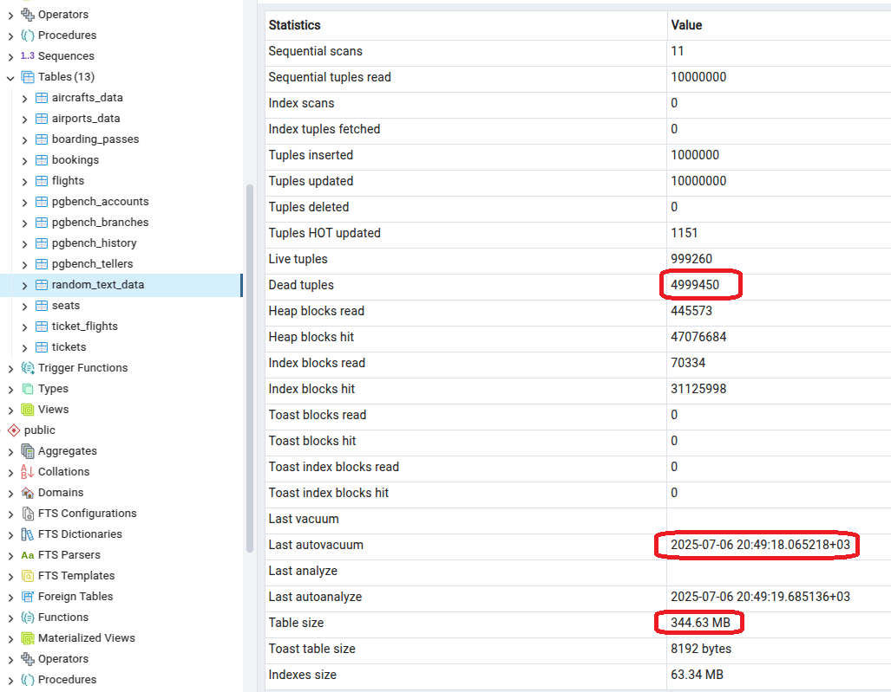
В этот раз автовакуум не сработал. Поэтому получилось, что размер таблицы увеличился примерно в 6 раз, а кол-во мертвых строк примерно столько же сколько строк мы обновили за 5 команд update.
Postgres версионирует таблицы. Поэтому при обновлении сохраняется предыдущая и появляется новая версия. И только vacuum и autovacuum способно избавиться от старых версий записей.