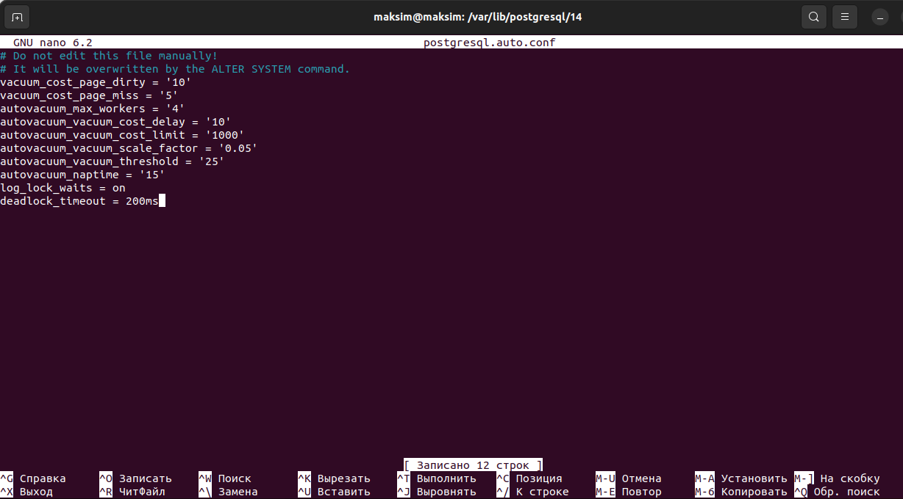
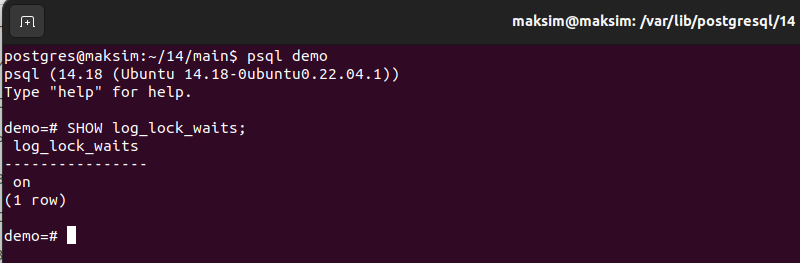
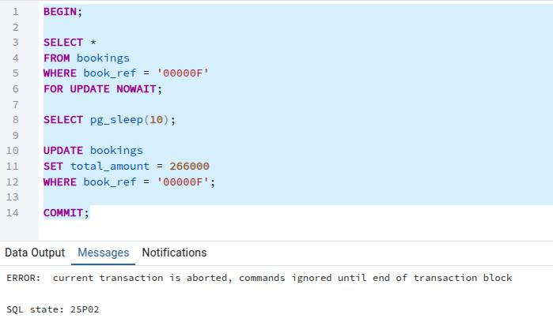
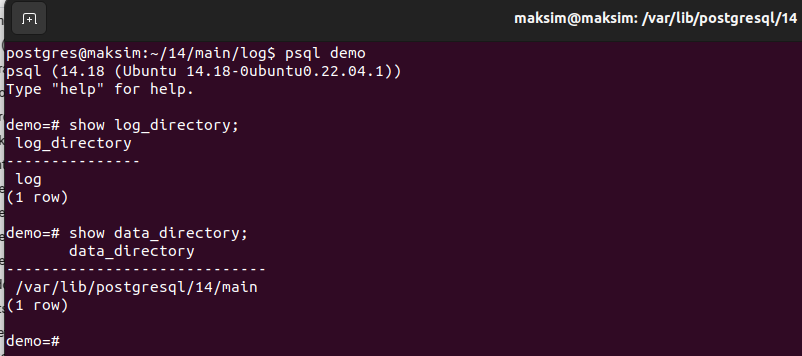
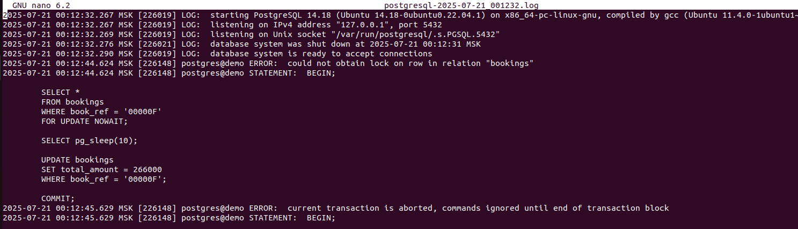
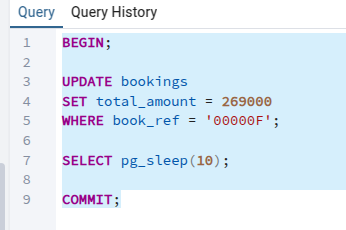
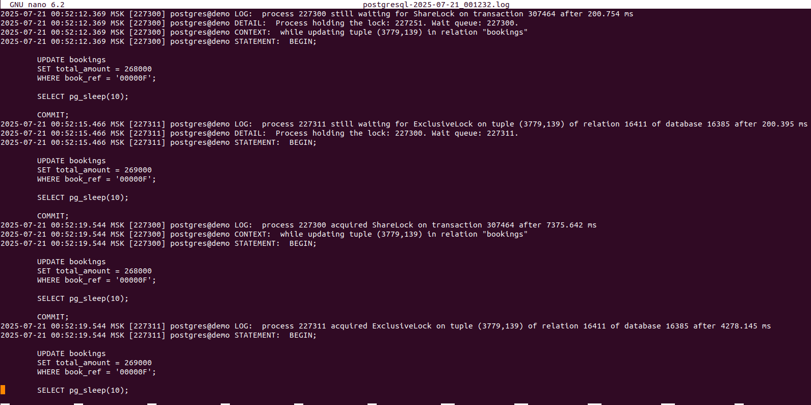
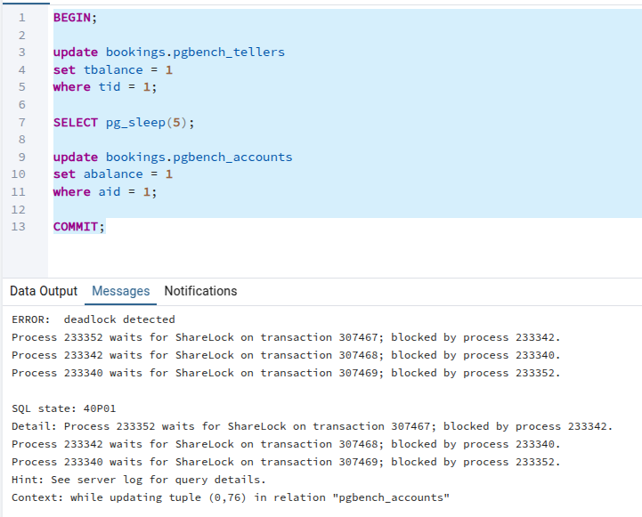
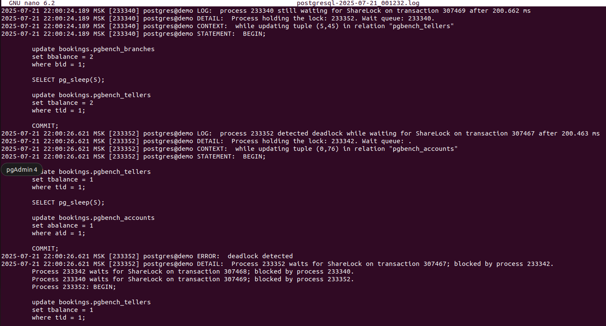

1. Для того, чтобы сервер начал писать информацию о блокировках в журнал - нужно настроить сервер через файл конфигов.
Для этого я зашел в postgresql.auto.conf:

Затем делаю перезагрузку постгреса с помощью команды:
```
sudo systemctl reload postgresql
```

Проверяю включено ли логирование:


2. Я написал следующий метод:
   


Запустил его в 2х сессиях. На скрине виден результат второй сессии, которая пытается сделать select к таблице, которая залочена на update. Поставил специально ожидание в 10 секунд, чтобы успеть за это время выполнить запрос в этой 2ой сессии.

3. С помощью команды:
```sql
show log_directory;
show data_directory;
```
Узнал куда пишутся логи:


Но в итоге по этому адресу логов не было. Оказалось необходимо дописать в postgresql.auto.conf ещё и сеттинг:
```
logging_collector = on
```
Чтобы весь лог писался именно в журнал. При этом ещё и создал саму папку log по пути:
```
/var/lib/postgresql/14/main
```
Потому что она не создается автоматически.

4. В итоге выполнил транзакции из 2го пункта снова и получил запись в лог:


По сути я наблюдаю весь лог теперь в этом журнале. И здесь указан моя ошибка, которая упала при попытке получить заблокированную запись.

5. Запустил в параллель 3 транзакции:
   


С разницей в total_amount.
Лог выглядит следующим образом:

Из лога могу сделать вывод, что каждая из транзакций ставила блокировку на соответствующей записи. И в итоге они выстраились в очередь на исполнение операции последовательно.
Я так понимаю что первая транзакция заблокировала строку ShareLock. Дальше вторая транзакция выстроилась в ожидании и накинула сама блокировку ExclusiveLock. И уже третья транзакция ждет снятия ExclusiveLock второй транзакцией.

6. Далее воспроизвожу ситуацию с взаимной блокировкой 3 транзакций.
Вот что получилось:


Это вывод последней запущенной транзакции. Постгрес умеет предотвращать блокировки. 2 транзакции выполнились, а третья отменилась с помощью deadlock detected.
Чтобы воспроизвести ситуацию я взял три запроса на обновление таблицы:
```sql
update bookings.pgbench_accounts -- таблица 1
set abalance = 1
where aid = 1;

update bookings.pgbench_branches -- таблица 2
set bbalance = 1
where bid = 1;

update bookings.pgbench_tellers -- таблица 3
set tbalance = 2
where tid = 1;
```
И в первой транзакции через небольшую задержку менял таблицу 1 и таблицу 2, во второй: таблицу 2 и таблицу 3, а в третьей: таблицу 3 и таблицу 1.

Отвечая на вопрос "Можно ли разобраться в ситуации постфактум, изучая журнал сообщений?"
Да можно. И вот тому доказательство:

В логах вся информация по блокировкам и нахождению deadlock'ов отражена.