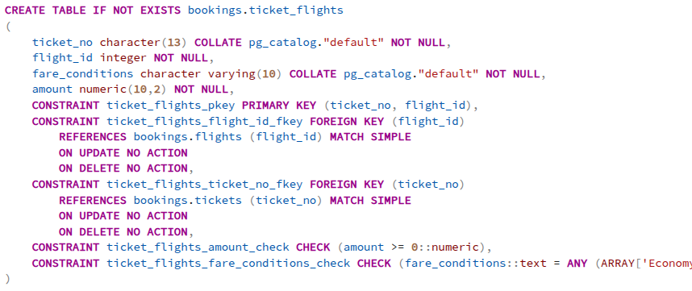
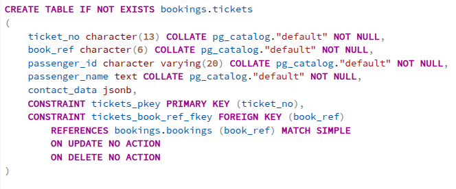
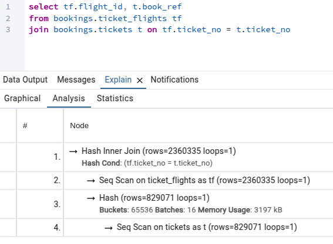
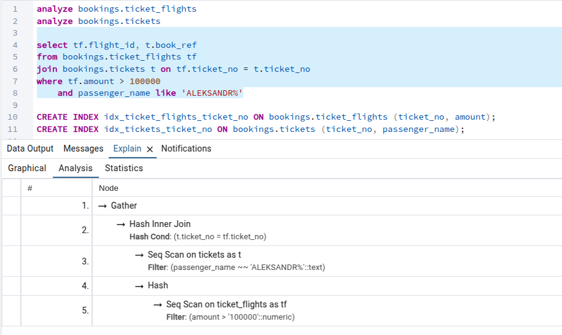
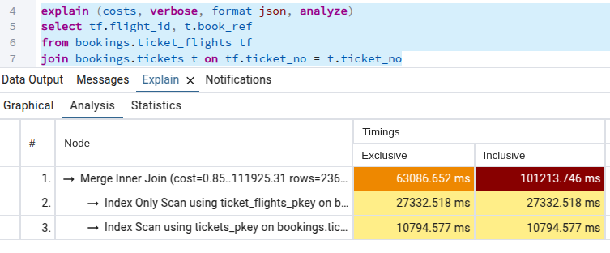
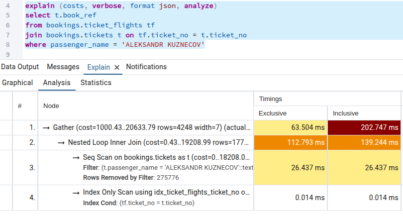
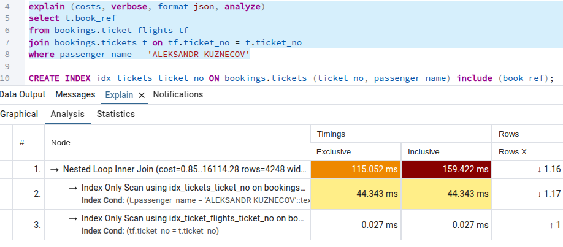
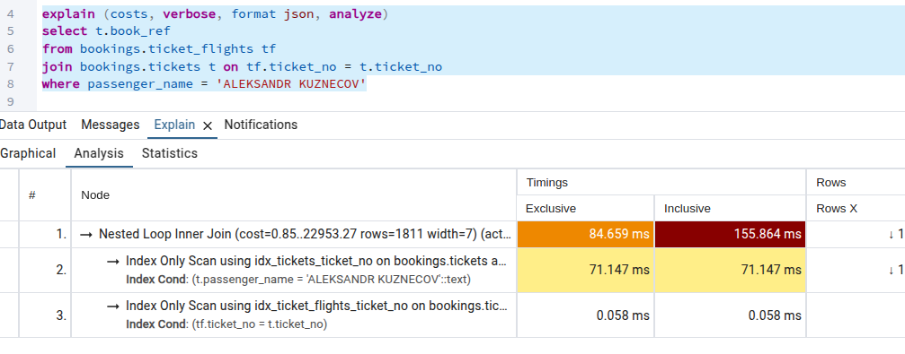
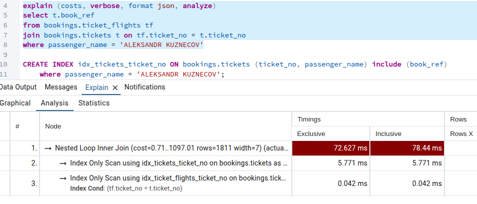
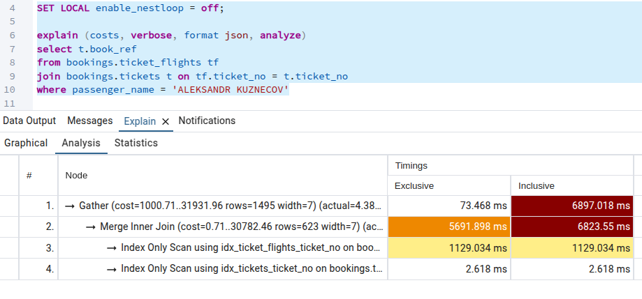

1. Продолжаю работать с тестовой БД demo-medium
(https://postgrespro.ru/docs/postgrespro/15/demodb-bookings-installation)
Для примера работы индекса отыскал несколько больших таблиц.
Например: ticket_flights:


В ней 2360335 записей.
Есть первичный ключ из двух полей: (ticket_no, flight_id) - он же индекс, отдельно созданных индексов на таблице нет.
Вижу что она связана с таблицей tickets:



Которая имеет первичный ключ, а значит и индекс на таблице по ticket_no, других индексов нет.
Отличные кандидаты для разбора.

2. Делаю запрос, в котором джойню эти 2 таблицы по внешнему ключу без фильтрации и вывожу по одному из полей из каждой таблицы:



По плану запроса видно, что планировщик построил Hash Join. По моим воспоминаниям: хэш таблица строится для таблицы с наименьшим кол-вом строк, во избежание меньших затрат.
Хоть и есть индекс - планировщик не стал им пользоваться. Думаю что дело в том, что мы никак не фильтруемся и получается мы буквально все строки из одной таблицы пытаемся объединить с другой таблицей. Попробую написать фильтр.

3. В итоге написал следующий запрос:

И добавил индексы по этим полям. Ожидал увидеть использование Merge Join в плане запроса. И не последовательного сканирования Seq Scan. А Index-only scan.
В итоге вынужден был вернуться к просмотру урока - практической его части.

4. Оказывается в постгресе можно выставить приоритеты для выбора планировщика:
seq_page_cost - условная единица стоимости последовательного чтения
random_page_cost - стоимость произвольного сканирования (т.е. как раз индексное сканирование)

У меня стояли значения по умолчанию:
seq_page_cost = 1
random_page_cost = 4

Как и рекомендовалось в уроке я выставил приоритет произвольного сканирования ближе к последовательному:
```sql
set random_page_cost = 1.25
```

В итоге вернулся назад. Удалил все индексы. И выставил индекс только на внешний ключ:
```sql
CREATE INDEX idx_ticket_flights_ticket_no ON bookings.ticket_flights (ticket_no);
```

И пошел с ним делать запрос:



Хоть я и получил что хотел: Merge Join и Index Only Scan. Запрос выполнялся очень долго. Из урока понял, что это из-за того, при джоине таблиц теперь приходится искать сначала в индексе запись, а потом уже переходить к ней по ссылке. И из-за сильно большого объема записей - это менее быстрая операция нежели Hash Join и Seq Scan.

5. Дальше я решил попробовать добавить покрывающий индекс на таблицу tickets.
На внешнем ключе стоял индекс. И я изменил запрос добавив туда фильтрацию:



Дальше я добавил покрывающий индекс на таблице tickets и перевыполнил запрос

У меня получилось изменить план запроса. Теперь оба запроса Index Only Scan. Производительность стала выше.

В целом Merge join поменялся на Nested Loop как только я добавил фильтрацию в запрос. При этом индекс есть и на внешнем ключе и со стороны tickets с покрывающим индексом. Я объясняю это тем, что в самой таблице tickets по фильтрации passenger_name находится всего один элемент. Т.е. таблица маленькая. Поэтому я решил посмотреть, а что если Александров Кузнецовых было бы много в таблице tickets.

6. В таблице tickets 829071 запись. Я решил для 63024 записей присвоить присвоить:
passenger_name = 'ALEKSANDR KUZNECOV'
В итоге получил примерно те же результаты. Nested Loop Join с двумя Index Only Scan.

7. Попробую ещё один способ построения индекса: это частичный индекс. Сделал так, чтобы 'ALEKSANDR KUZNECOV' было всего в 710 записях таблицы tickets. И посмотрю планировщиком предыдущий способ построения индекса, а потом с использованием частичного индекса.

А теперь установим вместо старого индекса частичный с фильтрацией по passenger_name = 'ALEKSANDR KUZNECOV':

Получили хороший прирост в скорости выполнения. Почти в 2 раза.

8. Если сильно захотеть, то мы можем склонить планировщик выбрать нашу стратегию поиска. И даже сделать это только в рамках текущей транзакции:



Но судя по времени выполнения - планировщику лучше знать как оптимальнее выполнить тот или иной запрос.