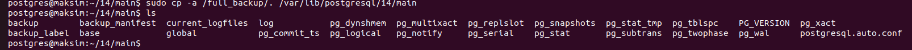

1. Сначала попробую сделать бэкап с помощью pg_dump:


Первым делом проверяю, что плагин у меня установлен. Далее смотрю список БД моих. Соответственно возьму для бэкапа БД demo.

Выполняю операцию:
```sql
pg_dump demo > demo_backup.sql
```
Операция выполнилась за 15 секунд.
Файл бэкапа сохранился прямо в папку вызова операции.
Откроем его:


По сути это большой скрипт всех операций по созданию и наполнению БД. pg_dump также позволяет создавать и в других форматах бэкап. Например, в файле с расширением .dump.

2. Дальше попробовал плагин pg_dumpall. Проверил что он также установлен и выполнил операцию:
```sql
pg_dumpall > all_databases_backup.sql
```
Выполнялся на удивление всего 5 секунд, хотя создавал бэкап для всех БД, что у меня есть. С другой стороны, у меня кроме demo только дефолтные пустые БД.

Результат примерно такой же:


3. Теперь пробую плагин pg_basebackup.
Как я понял: Команда pg_basebackup создает физический бэкап всего кластера PostgreSQL, т.е. это полная копия всех данных на уровне файловой системы (в отличие от pg_dump/pg_dumpall, это бинарная копия , а не SQL-скрипт).

Можно создать файл в формате .tar. А можно применить на нем компрессию.

Выполняю операцию. Операция выполнялась 40 секунд и вот её результаты:


4. Далее проверяем как настроен параметр wal_level:
```sql
show wal_level;
```
У меня стоит replica. Значит wal файлы могут служить для репликации.

Смотрим какие у меня есть кластеры:


Только один. Создаю второй, куда будем отправлять wal-файлы:


Создал кластер, удаляем все содержимое из его main папки:


5. Теперь для нового кластера с использованием известного нам плагина создаем копию нашего первого кластера:


Запускаем в работу оба кластера:


Теперь мы можем работать на обоих портах в двух разных кластерах:


6. Далее нужно провернуть то же самое, но с учетом WAL файлов.
Для этого необхоидмо включить архивирование WAL файлов.

Сейчас архивирование отключено:


7. Далее выполним команды согласно приложенному для ДЗ md файлу:

Для создания папки выполните команду
sudo mkdir /archive_wal

Для предоставления прав выполните команду
sudo chown -R postgres:postgres /archive_wal


включить режим архивирования WAL и прописать команду архивирования в файл конфигурации Postgres. 

ALTER SYSTEM SET archive_mode = 'on';
ALTER SYSTEM SET archive_command = 'test ! -f /archive_wal/%f && cp %p /archive_wal/%f';

Здесь описана команда для архивации wal файлов.


Чтобы изменения параметров вступили в силу, нужно перезапустить сервер:
sudo systemctl restart postgresql

Создать каталог для полного копирования
sudo mkdir /full_backup
sudo chown -R postgres:postgres /full_backup


Для проведения полного резервного копирования выполните команду
sudo -u postgres pg_basebackup -p 5432 -v -D /full_backup


В клиенте Postgres, например, DBeaver, выполните команды:
create table test (c1 text);

insert into test values ('Проверка восстановления с использованием WAL');

select now(); -- текущее время 2025-07-23 21:26:25.627321+03


Воспроизведем теперь ситуацию, что мы случайно поменяли Имя пассажира на всех билетах:


8. Восстановим теперь БД на определенный момент времени: Для это выполним следующие действия:
   
* Остановим сервер Postgres:
sudo systemctl stop postgresql

* Сохраним текущее состояние данных Postgres (на всякий случай).
sudo mkdir /old_data

И после этого переносим в него весь каталог с данными Postgres:
sudo mv /var/lib/postgresql/14/main /old_data

После этого нужно воссоздать каталог main:
sudo mkdir /var/lib/postgresql/14/main


* Копируем в main полную резервную копию:
sudo cp -a /full_backup/. /var/lib/postgresql/14/main



* В восстановленной резервной копии нужно почистить каталог pg_wal:
sudo rm -rf /var/lib/postgresql/17/main/pg_wal/*
и скопировать в этот каталог последний вариант WAL
sudo cp -a /old_data/main/pg_wal/. /var/lib/postgresql/17/main/pg_wal


* Затем редактируем файл конфигурации:
изменить в  postgresql.conf
restore_command = 'cp /archive_wal/%f "%p"'
(команда должна быть строго обратной команде на архивирование WAL)
recovery_target_time = '2025-07-23 21:26:25.627321+03'
(то время, которое мы зафиксировали).


Затем создаем пустой файл recovery.signal:
sudo touch /var/lib/postgresql/17/main/recovery.signal

меняем владение и права на каталог main с подкаталогами:
sudo chown -R postgres:postgres /var/lib/postgresql/17/main/
sudo chmod -R 750 /var/lib/postgresql/17/main/

И запускаем сервер:
sudo systemctl start postgresql


* Проверяем в клиенте, что таблица test в базе данных восстановлена:
select * from test;

И ошибочный update в таблице student отменен:
select * from student;


* После всех проверок можно открыть доступ к серверу не только на чтение, но и на запись:
select pg_wal_replay_resume();

